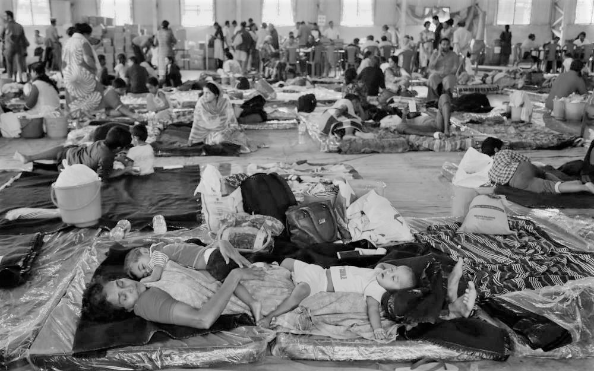
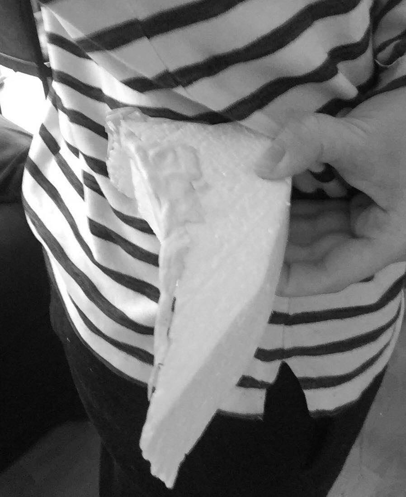
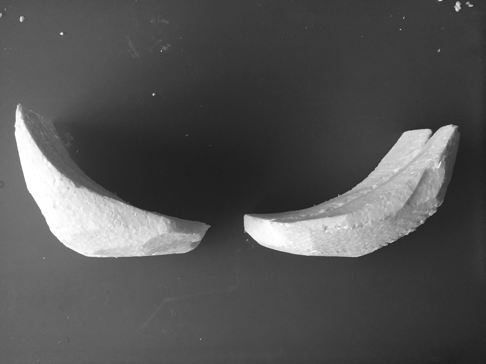
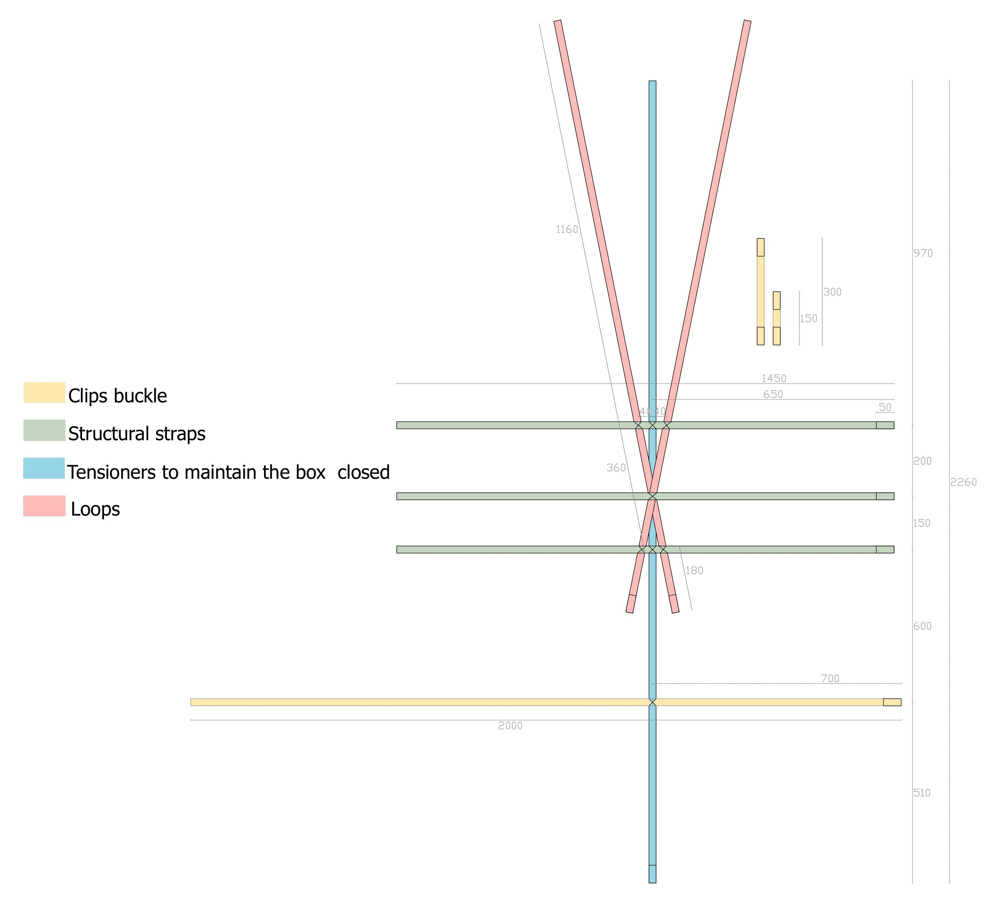

# PROCESS : refrigerant backpack

*Team: Claire Chavigny, Carla Debarre, Ibrahim Khaled, Louise Gorioux*

> _A backpack respecting the cold chain capable of carrying vaccines, allowing doctors to act while on the move and made from Myco-material._

## CONTEXT :

After disasters in India this August, the country has suffered of propagation of diseases following the poor hygiene conditions in the camps due to long wait surrounded by water. The emergency situation complicates the movement of citizens to hospitals, so many citizens do not have the opportunity to get vaccinated which amplifies the spread of diseases.

Moreover, after our first discussion with Michaël Gäthögö (an engineer at MSF), he told us that doctors don’t have a useful box to carry vaccines because of the uncertainty of the cold chain. In these conditions none precaution are established. 

*Disaster*

*Camp* 

## GOAL :

We realized the importance of acting quickly on health. Furthermore, following several exchanges with Michaël Gäthögö, we concluded that a portable device was conclusive. Then we discussed the design of a cold chain refrigerant bag, capable of transporting vaccines. This seemed a relevant idea regarding the doctors, so that they can act while being on the move and then reach more people, but also to avoid the overload of hospitals.

## IDEAS-PROTOTYPES :

### FIRST IDEAS : 
Our initial project idea was a Peltier system with ventilation but we rapidly conclude that it will be difficult due to the complexity of the conception (electronics system with battery…) and the  price. 
Then we headed back to two differents options without energy: an evaporation system (as a “desert fridge”) and insulation one. 
 

### EVAPORATION SYSTEM :
After researches, we quickly understood that the evaporation one will be difficult due to the high weight ; sand and terracotta, so came the idea of a plastic box. Due to the high rate of humidity in India (over than 80%) this system won’t allow the constant temperatures required for the medical products. Which means that the evaporation system won’t work. 

With the aim of  the climatic conditions, researches on the insulation system as well as hospitals and camps positions, we have hypothesized that the bag has to respect the cold chain around 6 hours. Through the composition (heat source and thermal insulation) the insulation system should be able to maintain constant heat over a specified period of time. However materials composition has to be carefully thought. We decided to pursue on this way to deepen and try prototypes.  
 

*Positions of hospitals in this region*

### INSULATION  SYSTEM :
Our first prototype in Haugimont was made with polystyrene as insulation (2cm) and Plexiglas (5mm)  box to avoid the contact between the vaccines and the heat source (cold or hot) in order to prevent the liquid from freezing. The box, which has been cut with the CNC, in order to discover machines and try the first hypothesis. This recipient contains 75 vaccines and three eutectic plates of 500ml each (around -10°C). The first conclusion was that the Plexiglas is too fragile and the box is too heavy. Then we tried the system with a thermometer on a certain time, it reached the correct temperature (between 2-8°C) but not quickly enough. 

*Prototype 1*

*Prototype 1-Eutectic plate*

*Prototype 1-Test*

After the first test, we concluded that the system works, to rise the conductivity and reduce the weight. We decided to make a second prototype with a lighter box. Using the same insulation’s system adding one more layer and a felt outside envelope to rise the performance. To avoid any perturbation  during opening the lid, we made slots in each of the two rubber layers (each slot is in different direction to decrease heat loss). After the experience on 8 hours, we noticed that the temperatures had passed below 0°C, the device is unreliable so we have to work on the temperature and the quantity of the eutectic plate which were both too high, the composition of the object and dimensions too. However the weight is appropriate.     

*Prototype 2-Box*

*Prototype 2-Slots*

*Prototype 2-Inside de box with eutectic plates*

*Prototype 2 - With insulant*

*Prototype 2- Test*

### IMPROVEMENT :

Following the week in Haugimont, we wanted to use local products to reduce the price of the bag. Further to some exchange with Prithvi Vesla (a contact living in Tamil Nadu, the province next to Kerala) we changed the two plastic boxes with one MDF box to reduce quantity of the material. We used tarpaulin instead of felt for the outside envelope to ensure the permeability of the bag during the transport. It will guarantee the permeability during transport. A new idea was to weld the tarpaulin with the polystyrene in, to protect it. 

Moreover we thought about the coconut fiber which is popular as an insulation and it’s an abundant resource but unfortunately we can not make something too heavy. To try the thermal resistance (the ratio between thickness and thermal conductivity) we reduced the thickness of the polystyrene (2cm). After two differents tests on 6 hours, the results were not good enough and have taken too much time to reach the right temperature. So we have to increase its thickness and test it again to assure the reliability. 
 

#### FIABILITY OF THE BAG : 
Concerning the first test, 4 eutectics plates of 500ml each were between -3° and -1°C. It is only after 40 minutes that the air inside the box reached the temperatures required and the minimum ambient fluctuated around 7°C. Moreover, after 2 hours the temperature exceed 8°C. That result was not sufficient.

*Prototype 3 - From above*

*Prototype 3-Test with 4 eutectic plates at T = -6°C*

For the second test, we tried the same amount of eutectic plates but colder ( -6°C and -9°C). We noticed an improvement compared to the previous one but it still not relevant enough. It takes too much time to achieve an ideal temperature as well as the stability. We had to reconsider the problem and think out of way. How could we improve the box’s shape and make it more ecological by using a new material.

*Prototype 3-Test 2 with 4 eutectic plates at T = [-9;-6]°C*

### INNOVATION :

After many reflexions and researches we wanted to create a project more inovant and more comfortable for the back. We discovered the mycelium,  the vegetative part of mushrooms that becomes hard as a rock and insulator while dehydrated. It has many great characteristics as light, resistant, waterproof, flammable and floating. Some people have already built structures (design bricks or atypical and unique shape) or created objects (bowl, chair, lampshade) and it showed off its success. 

#### INSULATING POWER OF THE MYCELIUM : 

-   **Thermal conductivity (W/(mK))** : It characterizes a material’s ability to drive the heat. The lower this value, the more insulating the material. According to the French RT2012 standards, a material is considered as insulating if its thermal conductivity lags behind 0,065 W/(mK). In comparison, the polystyrene ‘s thermal conductivity is 0.039W/(mK) at 24°C. (Demonstrated by Netzsch)

-   **Thermal resistance (m^2K/W)** : it defines the material's capacity to insulate for a certain thickness. It is the ratio between the material’s thickness (meter) by the factor of thermal conductivity λ. The higher the heat resistance, the more insulating the wall.

-   Lesmie BALTHAZAR obtains,throughout his study, a value of 0.058 W/(mK) for a substrate over chenevotte via thermal drying.(average density  0.113g/cm^3)

We concluded that the mycelium is a good insulator even though it is less performant than polystyrene. From results of the Polystyrene bag, it’s possible with the mycelium to achieve  similar results considerate the thermal conductivity and a lighter weight ( according to the board below ) :

*Table- Comparaison between polysteren and mycelium*

**Remark** : Regarding the outside temperature and its influence over the material’s thermal conductivity, a study lead by Netzsch shows that there is a difference of less than 1% between the value of thermal conductivity measured at 10°C and 24°C. Given the fact that the mycelium ‘s thermal conductivity isn’t far from the polystyrene’ s one, we can assume that its value at 20°C and at 30°C won’t be any different. Unfortunately, because of a lack of time and samples, we couldn’t conduct our own thermal conductivity’ s measures; this is why we made assumptions. 

*Graphe of deviation from mean of thermal conductivity for polystyrene*

#### HOW TO DO IT ?
It’s possible to cultivate mycelium from pieces of mushroom and various substrates in sterilized boxes. To try this new material we have attempted to cultivate six different ways to be able to assert the quickest.  

- N°1:  Button mushroom + cardboard 
- N°2: Oyster mushroom + cardboard
- N°3: Button mushroom + walnut shell +  flower 
- N°4: Oyster mushroom + walnut shell +  flower 
- N°5: Button mushroom  + coffee ground + cardboard
- N°6: Oyster mushroom + coffee ground + cardboard

After two weeks into the dark, the oyster mushroom and some coffee ground were the best (n°6). Following this step, three more steps are essential to produce the insulated myco-material : the inoculation, the incubation and the dehydration. 
 

*Mycelium*

Furthermore, a cardboard mould is essential for myco-material’s development which is the incubation. To create the mould, we used the sliced technique, using the laser , then we covered it with paper and added plastic to facilitate the adhesion of mycelium. The use of a heat-shrinkable plastic will be easier and quicker. Our mistakes were that we didn’t test the shape of the back on us and we didn’t realize that we needed to open the mould to process the dehydration step. Moreover the thickness of the cardboard (2mm) to make the mould was too thin so not enough robust to join all pieces. 
 

*Mould*

*Mould- From above*

### WORK ON THE BAG’S SHAPE : 
After researches on different composition of trekking bag and discussions with our professors about the ergonomic of the bag, we decided to create a bag in polystyrene because of the facilities to sculpt and compare directly with the reality. Moreover we have used modeling pastes which can take a specific form from the body. We have tried 3 different shapes. 

First, we tried a shape that covered all the length on each side of the back but we quickly stopped designing it because after several fittings we understood it wasn’t necessary to put that much.

*Test0-Shape who covered all the length*

Secondly, we tried a device that surrounds the waist and we noticed that it really helps for the back‘s support. Before finding the right form, we used paste to take the appropriate shape. These modules will be part of the mycelium mould and are enclosed by the adjustment ’s straps.

*Test1- Shape for the lower back* 

*Test2- Shape for the lower back* 

*Test3-Test- Shape for the lower back*

Once we were satisfied, we focused on the upper back. We tried different shoulder blade ‘s shapes. We first tried something rounded that touched the bones but it wasn’t comfortable because of pushing the upper back forward. It was disturbing the free movement of the arm. 

*Test1-Shape for upper back*

We headed to something thinner, covering the outer part of the shoulder blade. Same as before, we used the modelling paste to approach the best as we can the right shape. 

*Test2-Shape for upper back*

*Test2- Other view*

*Test2-On the model*

We ended up increasing the outer part, because it felt more comfortable and supporting. After some adjustments, we were pleased with the results so we made it the final version. 

*Final version*

Concerning the straps, there are 4 different types. The vertical straps and the loops are joined together by tensioners. The chest and waist straps are fixed together with clip buckles. In order to avoid any disturbance of the straps we crossed it, giving them a direction holding by three more horizontal straps on three differents levels. 

*Straps plan*

*Straps in real*

#### FIABILITY OF THE BAG : 
We started a new temperature test after 3 hours of refrigeration of the 9 eutectic plates of 200ml each (with temperatures varying from -8°C to -4°C). We observed a drop of the temperature after inside the box that was expected (after 10 min) because it will ensure the rapid departure of the doctors from the hospitals. The box answered the required criteria (between 2°C-8°C) on a 5 hours period. 

*Final prototype-View of the box from above*

*Final prototype-Test eutectic plates at T=[-8;-4]°C*

We wanted it to last a bit more so we started a new test and added 5 more eutectic plates of 200mL But it reached zero too quickly so we stopped it. Here are the results :

*Final prototype-Test2 Failed*

We then decided to reproduce the test but with an initial temperature (of the eutectic plates) around -3°C and 0°C.

*Final prototype-Test3 eutectic plates at T=[-3;0]°C*

The results were a little bit different. At the beginning, the temperature dropped slower than the prototype n°4 test 1 (in 15 min). However there was a better stabilisation of the temperature over the 5 hours. Concerning all the test, the cold chain was respected over 5h30 maximum. 

Finally, following the previous results,there are two trends in our graphs. In the first time of a decline. Firstly, an exponential decay of the temperature to a global minimum and then a linear trend growth. From this observation, adjustments can be made to derive a model whose parameters are:

- Minimum temperature required (T_0)

- Parameter related to the cooling rate (alpha)

- Slope of the linear part related to the temperature increase (beta).
Parameter that affects the cooling rate (related to material properties)

*Final graph-Comparison between our test and the model which represent the theoretical expected result*

we remark that the eutectic plates’ s number affect the duration in which the box stays between 2°C and 8°C. The temperature of the plates affect the minimum temperature that the box will reach. 

In order to improve the system, one could consider increasing the volume of insulation that would be in Mycelium and therefore do not increase enormously the mass of the bag. In addition, it would be necessary to find the best configuration of the eutectic plates for its influence on the parameters of the model. Finally, the recovery of materials should be optimized to reduce the cost of producing the bag.

*The refrigerant backpack is ready !*

We approached this project from the point of view of health, since this problem seemed to us all to be really important. There is still a lot to improve but we hope that it will give many ideas and motivation to NGOs to develop a better version. We also wanted to support agricultural production by promoting mycelium cultivation and methods of innovative and conscientious construction of the environment.

