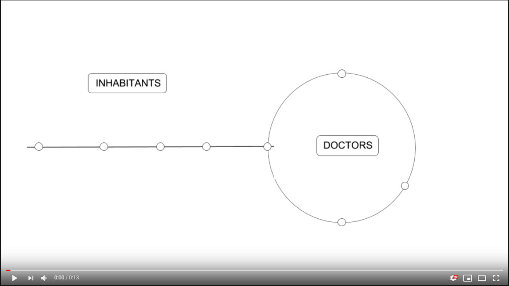
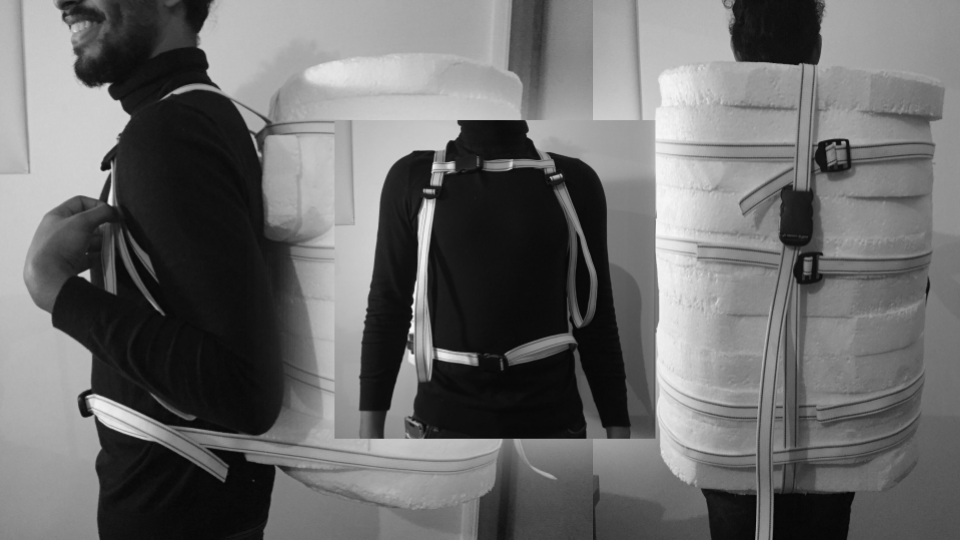

# Kerala_Project

# __PROJECT : refrigerant backpack__
*Team: Claire Chavigny, Carla Debarre, Ibrahim Khaled, Louise Gorioux*

> *A Myco-material backpack respecting the cold chain capable of carrying vaccines, allowing doctors to act while on the move to reach as many people as possible.*

## Project summary :

After many researches on the web, discussion with Indians, people from the medical sphere, our professors  and reflexions within our groupe, the project consists of a backpack capable of transporting vaccines, in an appropriate environment (2°- 8°C) over a six-hour period. Following the floods in India during last summer, poor healthcare has developed in the camps and diseases are spreading quickly. Moreover, if inhabitants want to be vaccinated they need to go to hospitals which are crowded in those moments. The project would be used during the camp period when infections are most common but also in everyday life to increase the impact of vaccination. 

The goal is to stop the spread of infection, reaching as many people as possible by giving them the opportunity to be immunized, thanks to the doctors on the field. Furthermore it will avoid the overload in hospitals. The project acts as a prevention in the camps after the disaster . The project aims to be more innovative than a cooling box by creating a myco-material refrigerant backpack. 

After several prototypes, tests and questioning, (cfr: process) we developed a backpack in polystyrene to find the best shape for the back and its thermal resistance (the ratio between thickness and thermal conductivity). In the bag stands a wood composite box (270mmx200mmx440mm) in which the 1O5 vaccines are located. Around the box are placed the eutectic plates. An unique assembly of straps is using all around the bag (it’s possible to use recovery material). 

The mycelium and the polystyrene have similarities regarding the thermal conductivity. It brings lightness to the bag. (cfr process).
To carry on our project, the backpack will be made by mycelium, which is the mushroom’s seed that could be developed by themselves. Thanks to it and the addition of substrate as sawdust, we are able to manufacture the material, called myco-material, biodegradable and one hundred percent ecological. For the development of the myco-material,  a cardboard mold’s need to be produced with the laser, as well as the box containing vaccines, from a file that we have made. 

The myco-material produces ten times lower carbon dioxide and uses eight times lower energy than the production of polystyrene foam. Its thermal conductivity is good enough to make it a good insulator completely ecological and biodegradable compared to polystyrene.

Concerning the production, Kerala arranges 22 fablabs and 3000 camps (disaster in august 2018) have taken their seats through the state. Furnishing two bags (210 vaccines) per camp means that every fablab should provide 270 bags. The web of fablabs in Kerala being dispersed, it would help us to send the bags to the various hospitals around. 

Regarding the time of production, we calculate that we need 5h beside the 30 days of myco-materials culture. The price of the bag is approximately 30 euros and total weights is 3.7kg.

We approached this project through the healthcare problem, that seemed important to all of us. There are many things still to be improved and we hope it will give idea and motivation to the NGO to develop a better version of it. We also wanted to enhance the agricultural crop by  using mushrooms and promoting innovative way of building that take care of the environnement. 

##  Storyboard :

##  Final prototype: 

## Tutorial :

##  Bibliography :
- Contacts:
	- Pauline Kennes and Catherine Bachy at DWB Belgium

	- Michäël Gäthögö at DWB

	- Prithvi helped us as a local inhabitant
- Links:
	- [http://www.who.int/immunization/programmes_systems/supply_chain/optimize/Cooling_17july12.pdf](http://www.who.int/immunization/programmes_systems/supply_chain/optimize/Cooling_17july12.pdf)

	- [https://www.cdc.gov/vaccines/recs/storage/downloads/emergency-transport.pdf](https://www.cdc.gov/vaccines/recs/storage/downloads/emergency-transport.pdf)

	- [https://www.permafungi.be/projet/](https://www.permafungi.be/projet/)

	- [https://www.mediamatic.net/en/page/69393/mycelium-theorists-scientists](https://www.mediamatic.net/en/page/69393/mycelium-theorists-scientists)

	-	https://emergency.unhcr.org

	-	[https://motherboard.vice.com/en_us/article/pgazx8/the-house-that-spores-built](https://motherboard.vice.com/en_us/article/pgazx8/the-house-that-spores-built)

	-	[http://www.mycoworks.com/](http://www.mycoworks.com/)

	-	[http://ecovativedesign.com/](http://ecovativedesign.com/)

	-	[https://www.irit.fr/neocampus/images/stages/2018/Balthazar-Lesmie_Stage.pdf](https://www.irit.fr/neocampus/images/stages/2018/Balthazar-Lesmie_Stage.pdf)
	-   [http://www.cg43.fr/sites/cg43/IMG/pdf/guide_des_materiaux__isolants.pdf](http://www.cg43.fr/sites/cg43/IMG/pdf/guide_des_materiaux__isolants.pdf) 

	-	[https://www.netzsch-thermal-analysis.com/fr/materiaux-applications/isolation-thermique/polystyrene-expanse-conductivite-thermique/](https://www.netzsch-thermal-analysis.com/fr/materiaux-applications/isolation-thermique/polystyrene-expanse-conductivite-thermique/)
	-   [http://champignonscomestibles.com/clonage-culture-mycelium-carton-champignon?fbclid=IwAR3gGQV-I-8NpoABAhbPs69Wjr7dqdKYpgR8qhiwi3MI7uJcOvaIY5pMYXM](http://champignonscomestibles.com/clonage-culture-mycelium-carton-champignon?fbclid=IwAR3gGQV-I-8NpoABAhbPs69Wjr7dqdKYpgR8qhiwi3MI7uJcOvaIY5pMYXM)

	-	DUNCHEVA T., “Recycling : Mycology, Materials Science and Architecture”, AR521:Interdisciplinary University of Kent, 2013.

	-	JAMESON C., THOMAS T.J., WILLIAMS R., Mycelium Material Study, Studio Mur Mur Chicago, 2014.
